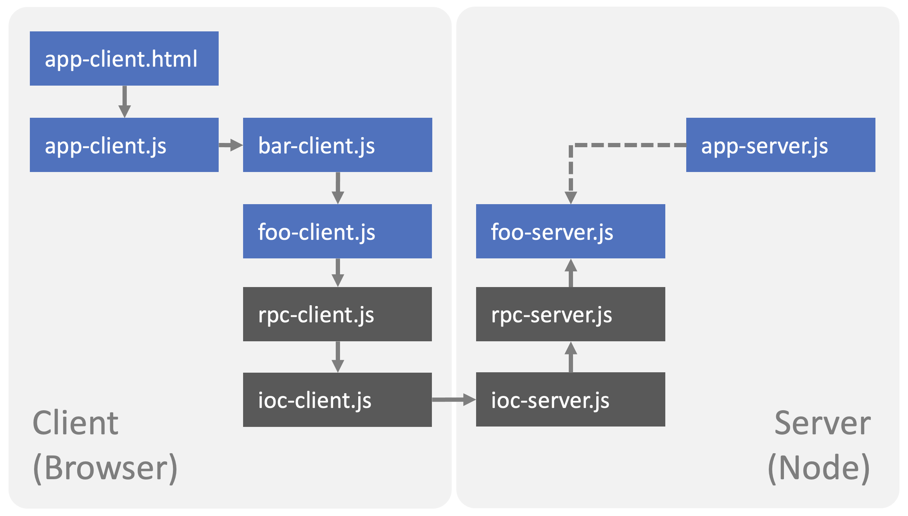

TinyRPC
=======

About
-----

TinyRPC is a tiny/barebone/small Remote Procedure Call (RPC) mechanism.
It is intended for education purposes only.

Copyright & License
-------------------

Copyright &copy; 2024 [SEA Software Engineering Academy gGmbH](mailto:contact@softeng.academy) 
Licensed under [MIT](https://spdx.org/licenses/MIT) license

